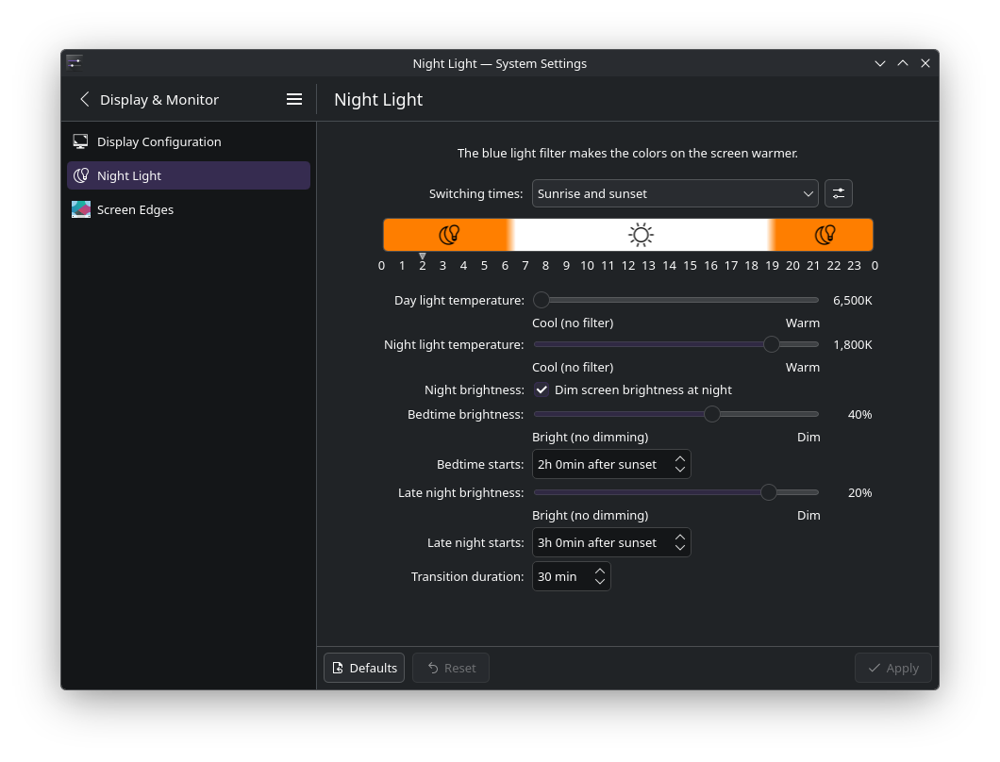
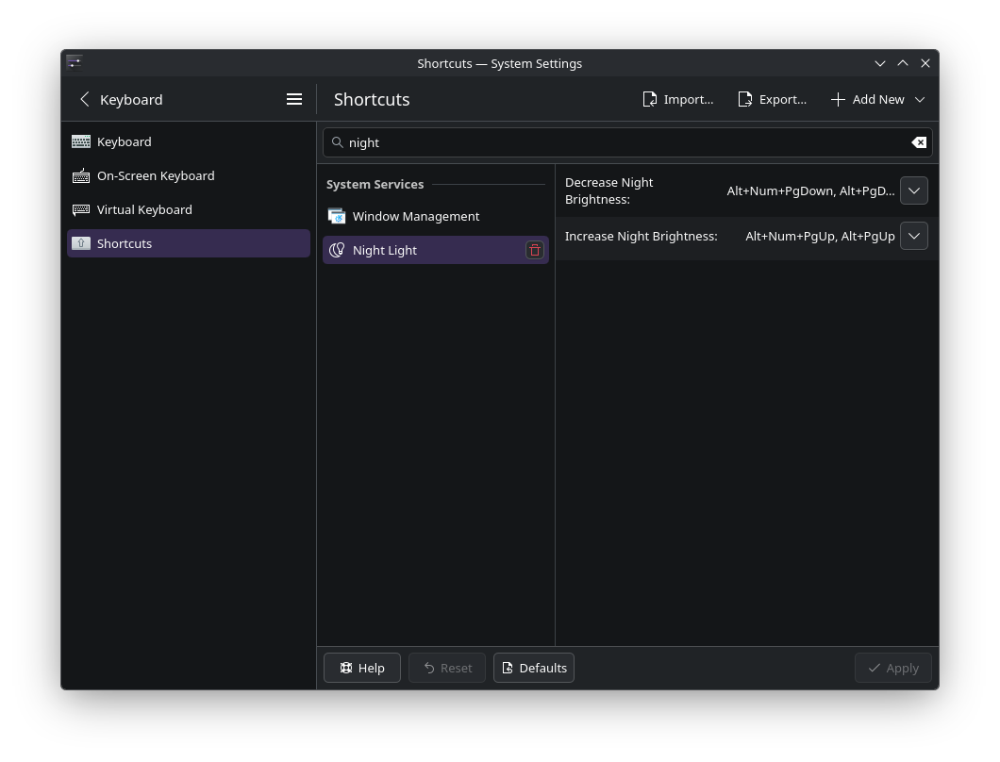

# KDE Night Light Dimming

Automatic DDC/CI hardware brightness scheduling for KDE Plasma, integrated into the Night Light settings page. Dims your external monitor's backlight based on sunrise/sunset — the brightness counterpart to Night Light's color temperature.



## What It Does

Night Light already shifts color temperature at sunset. This adds **hardware brightness dimming** to the same schedule:

- **Daytime**: Full brightness (100%)
- **Bedtime** (configurable, default 2h after sunset): Reduced brightness (default 40%)
- **Late night** (configurable, default 3h after sunset): Low brightness (default 20%)
- **Sunrise**: Gradual return to full brightness

Transitions are smooth — brightness changes in small steps over configurable durations (default 30 minutes per transition).

### Manual Override

**Alt+PgUp / Alt+PgDn** adjust brightness at any time. Scheduled dimming resumes at the next transition boundary.

## How It Works

Two patches to two KDE packages:

| Package | What Changes | Purpose |
|---------|-------------|---------|
| **powerdevil** | New `NightBrightness` Action plugin | Daemon: reads sunrise/sunset schedule, sets DDC/CI brightness via `setBrightness()` |
| **plasma-workspace** | Night Light KCM additions | UI: brightness controls in System Settings → Display & Monitor → Night Light |

### Architecture

```
KNightTime (knighttimed)              PowerDevil
  KDarkLightScheduleProvider            NightBrightness Action
  ├─ sunrise/sunset times ──────────►  ├─ computes brightness for current time
  └─ scheduleChanged signal ────────►  ├─ setBrightness() → DDC/CI VCP 0x10
                                       ├─ Alt+PgUp/PgDn keybinds
                                       └─ QTimer → next scheduled change

plasma-workspace (Night Light KCM)
  ├─ Brightness controls in Night Light settings page
  └─ Config stored in kwinrc [NightColor] group
```

**Key design decisions:**
- Uses `setBrightness()` for direct DDC/CI hardware writes — NOT `setDimmingRatio()` which is silently ignored for SDR external monitors in Plasma 6.2+ (see [Technical Notes](#technical-notes))
- Schedule from `KDarkLightScheduleProvider` (KNightTime framework) — decoupled from Night Light color temperature. Works independently of whether color shifting is enabled
- Config lives in `kwinrc` `[NightColor]` group alongside Night Light settings — single source of truth
- Keybinds registered under "Night Light" shortcuts group

## Compatibility

- **KDE Plasma**: 6.6.x (tested on 6.6.3). Patch scripts match specific source patterns — may need adjustment for other versions.
- **Distribution**: Build instructions are for Arch Linux / EndeavourOS. Other distros that build KDE from source can adapt the patch scripts.
- **Monitor**: Any DDC/CI capable external monitor. Tested on Dell U2724D via HDMI with NVIDIA RTX 5060 Ti (proprietary driver).

## Installation (Arch Linux / EndeavourOS)

### Prerequisites

- KDE Plasma 6.6+
- DDC/CI capable monitor (most modern monitors)
- `ddcutil` working (`ddcutil detect` shows your monitor)
- Python 3

### Build and Install

**PowerDevil (daemon):**

```bash
# Get the PKGBUILD
git clone https://gitlab.archlinux.org/archlinux/packaging/packages/powerdevil.git ~/nightbrightness/powerdevil-pkg
cd ~/nightbrightness/powerdevil-pkg

# Download and extract source
makepkg -o --skippgpcheck

# Apply patch
python3 patch-powerdevil-nightbrightness.py src/powerdevil-*/

# Build
makepkg -ef --skippgpcheck

# Install
sudo pacman -U powerdevil-*.pkg.tar.zst

# Protect from updates
sudo sed -i 's/^IgnorePkg = \(.*\)/IgnorePkg = \1 powerdevil/' /etc/pacman.conf
```

**Night Light KCM (UI):**

```bash
# Get the PKGBUILD
git clone https://gitlab.archlinux.org/archlinux/packaging/packages/plasma-workspace.git ~/nightbrightness/plasma-workspace-pkg
cd ~/nightbrightness/plasma-workspace-pkg

# Download and extract source
makepkg -o --skippgpcheck

# Apply patch
python3 patch-plasma-nightbrightness.py src/plasma-workspace-*/

# Configure (full cmake needed, but only one target built)
cmake -B build -S src/plasma-workspace-*/ -DCMAKE_INSTALL_LIBEXECDIR=lib -DGLIBC_LOCALE_GEN=OFF -DBUILD_TESTING=OFF

# Build ONLY the Night Light KCM
cmake --build build --target kcm_nightlight

# Install the single .so
sudo cp build/bin/plasma/kcms/systemsettings/kcm_nightlight.so \
        /usr/lib/qt6/plugins/plasma/kcms/systemsettings/kcm_nightlight.so
```

**After installation:** Log out and back in. Open System Settings → Display & Monitor → Night Light. The brightness controls appear below the color temperature sliders.

### After System Updates

- `powerdevil`: Protected by IgnorePkg. Re-patch manually when you want to update.
- `plasma-workspace`: NOT in IgnorePkg (too broad). After `pacman -Syu` updates it, re-run the KCM build steps above.

## Configuration

All settings are in `~/.config/kwinrc` under `[NightColor]`:

| Setting | Default | Description |
|---------|---------|-------------|
| `NightBrightnessEnabled` | false | Master enable |
| `NightBrightnessBedtimePct` | 40 | Bedtime brightness (% of max) |
| `NightBrightnessLateNightPct` | 20 | Late night brightness (% of max) |
| `NightBrightnessBedtimeOffsetMin` | 120 | Minutes after sunset for bedtime |
| `NightBrightnessLateNightOffsetMin` | 180 | Minutes after sunset for late night |
| `NightBrightnessTransitionMin` | 30 | Transition ramp duration (minutes) |

## Keyboard Shortcuts

| Shortcut | Action |
|----------|--------|
| Alt+PgUp | Increase brightness (5% steps) |
| Alt+PgDn | Decrease brightness (5% steps) |

Shortcuts appear in System Settings → Shortcuts under "Night Light."



## Technical Notes

### Why Not setDimmingRatio()?

PowerDevil's `setDimmingRatio()` API — used by the existing "Dim screen" idle feature — does NOT work for DDC/CI external monitors on Plasma 6.2+. The API stores the ratio internally and sends a dimming multiplier to KWin via Wayland protocol, but KWin ignores SDR dimming multipliers (disabled in [MR !455](https://invent.kde.org/plasma/powerdevil/-/merge_requests/455)). The API appears to work (logs confirm ratio applied) but no DDC/CI write occurs.

This implementation uses `setBrightness()` directly, which goes through the working DDC/CI VCP code 0x10 write path — the same path the brightness slider uses.

### Dependencies

- **KNightTime** (`knighttime` package): Sunrise/sunset schedule provider by Vlad Zahorodnii. Already a dependency of KWin and plasma-workspace. Added as dependency to PowerDevil's NightBrightness action.
- **KGlobalAccel** / **KXmlGui**: For keyboard shortcut registration. Already available in the KDE Frameworks stack.

### Files Modified

**powerdevil:**
- `daemon/actions/bundled/nightbrightness.{h,cpp}` (new)
- `daemon/actions/bundled/powerdevilnightbrightnessaction.json` (new)
- `daemon/actions/bundled/CMakeLists.txt` (plugin registration)
- `CMakeLists.txt` (KNightTime dependency)

**plasma-workspace:**
- `kcms/nightlight/nightlightsettings.kcfg` (6 new config entries)
- `kcms/nightlight/ui/main.qml` (brightness controls)

## License

GPL-2.0-or-later — matching PowerDevil and plasma-workspace.

## Author

Sean Smith (DefendTheDisabled) — developed with AI agent assistance (OpenCode ACF multi-agent framework).

## Status

**Working on local deployment** (EndeavourOS, KDE Plasma 6.6.3, Dell U2724D via HDMI, NVIDIA RTX 5060 Ti).

Awaiting real-world day/night cycle verification before upstream submission to KDE.

### Upstream Path

1. KDE Discuss — feature proposal and community feedback
2. bugs.kde.org — feature enhancement request
3. invent.kde.org — merge requests to `plasma/powerdevil` and `plasma/plasma-workspace`
